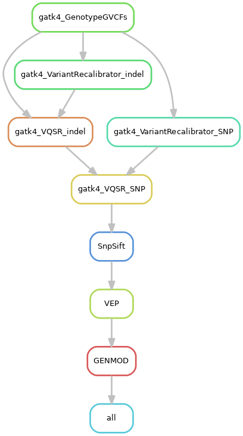

# vcf_annotation_pipeline

A simple Snakemake workflow to annotate variant call format (VCF) files using GATK4, SnpSift, VEP and genmod. Designed to be used after human_genomics_pipeline.

## Table of contents

- [vcf_annotation_pipeline](#vcfannotationpipeline)
  - [Table of contents](#table-of-contents)
  - [Workflow diagram](#workflow-diagram)
  - [Set up and run vcf_annotation_pipeline against GRCh37](#set-up-and-run-vcfannotationpipeline-against-grch37)
    - [Download data/repository](#download-datarepository)
    - [Set up the working environment](#set-up-the-working-environment)
    - [Run the pipeline](#run-the-pipeline)
    - [Resource allocation](#resource-allocation)
  - [Useful links/papers](#useful-linkspapers)

## Workflow diagram



## Set up and run vcf_annotation_pipeline against GRCh37

- **Prerequisite software:**  [Conda 4.8.2](https://docs.conda.io/projects/conda/en/latest/index.html), [tabix](http://www.htslib.org/doc/tabix.html), [bgzip](http://www.htslib.org/doc/bgzip.html), [gunzip](https://linux.die.net/man/1/gunzip), [bwa](http://bio-bwa.sourceforge.net/), [samtools](http://www.htslib.org/), [aria2](https://anaconda.org/bioconda/aria2)
- **Prerequisite data:** Reference human genome and dbSNP database
- **OS:** Validated on Ubuntu 16.04

### Download data/repository

Clone the [vcf_annotation_pipeline](https://github.com/ESR-NZ/vcf_annotation_pipeline) repository

```bash
git clone https://github.com/ESR-NZ/vcf_annotation_pipeline
```

Create a publicData directory to download public databases into

```bash
mkdir publicData
cd publicData
```

Download [Ensembl-VEP](https://asia.ensembl.org/info/docs/tools/vep/index.html) database

```bash
# Create a conda environment
conda create --name download_data_env python=3.7
conda activate download_data_env
# Install conda package of VEP
conda install -c bioconda ensembl-vep=99.2
# Download VEP database
vep_install -a cf -s homo_sapiens -y GRCh37 -c /store/lkemp/publicData/vep/GRCh37 --CONVERT
conda deactivate
```

Download [other databases](https://gatk.broadinstitute.org/hc/en-us/articles/360035890811-Resource-bundle)

```bash
# Mills
wget ftp://gsapubftp-anonymous@ftp.broadinstitute.org:21/bundle/hg19/Mills_and_1000G_gold_standard.indels.hg19.sites.vcf.gz
# 1000G indel
wget ftp://gsapubftp-anonymous@ftp.broadinstitute.org:21/bundle/hg19/1000G_phase1.indels.hg19.sites.vcf.gz
# 1000G snp
wget ftp://gsapubftp-anonymous@ftp.broadinstitute.org:21/bundle/hg19/1000G_phase1.snps.high_confidence.hg19.sites.vcf.gz
# Omni
wget ftp://gsapubftp-anonymous@ftp.broadinstitute.org:21/bundle/hg19/1000G_omni2.5.hg19.sites.vcf.gz
# Hapmap3
wget ftp://gsapubftp-anonymous@ftp.broadinstitute.org:21/bundle/hg19/hapmap_3.3.hg19.sites.vcf.gz
```

Convert files to bgzip format and create their associated index files

```bash
gunzip Mills_and_1000G_gold_standard.indels.hg19.sites.vcf.gz
bgzip Mills_and_1000G_gold_standard.indels.hg19.sites.vcf
tabix Mills_and_1000G_gold_standard.indels.hg19.sites.vcf.gz

gunzip 1000G_phase1.indels.hg19.sites.vcf.gz
bgzip 1000G_phase1.indels.hg19.sites.vcf
tabix 1000G_phase1.indels.hg19.sites.vcf.gz

gunzip 1000G_phase1.snps.high_confidence.hg19.sites.vcf.gz
bgzip 1000G_phase1.snps.high_confidence.hg19.sites.vcf
tabix 1000G_phase1.snps.high_confidence.hg19.sites.vcf.gz

gunzip 1000G_omni2.5.hg19.sites.vcf.gz
bgzip 1000G_omni2.5.hg19.sites.vcf
tabix 1000G_omni2.5.hg19.sites.vcf.gz

gunzip hapmap_3.3.hg19.sites.vcf.gz
bgzip hapmap_3.3.hg19.sites.vcf
tabix hapmap_3.3.hg19.sites.vcf.gz
```

Download [CADD database and it's associated index file](https://cadd.gs.washington.edu/download). (For now, the CADD database will need to be downloaded within the vcf_annotation_pipeline working environment due to how the genmod singularity container is mounted in the GENMOD rule.)

```bash
cd ../vcf_annotation_pipeline/
mkdir CADD
cd CADD
aria2c -c -s 10 https://krishna.gs.washington.edu/download/CADD/v1.4/GRCh37/whole_genome_SNVs.tsv.gz
wget https://krishna.gs.washington.edu/download/CADD/v1.4/GRCh37/whole_genome_SNVs.tsv.gz.tbi
```

### Set up the working environment

Set the the appropriate variables in 'config.yaml'. Set the file directory to the publicData folder containing the data we downloaded above

```yaml
PUBLICDIR:
  "/store/lkemp/publicData/"
```

Also set the file directory to the variant call format (vcf) files such as those output by human_genomics_pipeline

```yaml
SAMPLEDIR:
  "../human_genomics_pipeline/vcf/"
```

For now, also manually set this file directory in line 19 of the Snakefile to ensure the global wildcard function works correctly

Create and activate a conda environment with python, snakemake and genmod installed

```bash
conda create --name annot_pipeline_env python=3.7
conda activate annot_pipeline_env
conda install --channel bioconda snakemake=5.10.0
```

### Run the pipeline

First start a dry run. If there are no issues, start a full run without the -n flag

```bash
snakemake -n -r -j 24 -p --use-conda --use-singularity
snakemake -r -j 24 -p --use-conda --use-singularity
```

### Resource allocation

If necessary, the maximum number of CPU cores allocated by changing the -j flag in the snakemake program. For example to scale to run on a laptop/desktop...

```bash
snakemake -r -j 4 -p --use-conda --use-singularity
```

## Useful links/papers

Van der Auwera et al., (2013). *Current Protocols in Bioinformatics*. [From FastQ data to high confidence variant calls: the Genome Analysis Toolkit best practices pipeline](https://www.ncbi.nlm.nih.gov/pmc/articles/PMC4243306/); 11(1110): 11.10.1–11.10.33.
