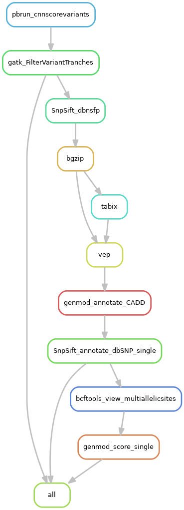
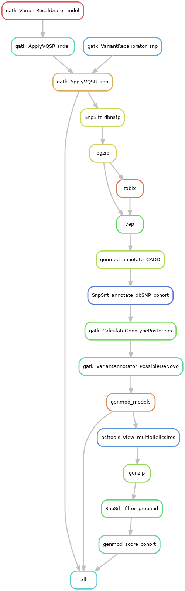

# vcf_annotation_pipeline

A Snakemake workflow to filter raw variants (snp and indels) and annotate variant call format (VCF) files (single samples or cohorts) using [GATK4](https://gatk.broadinstitute.org/hc/en-us), [SnpSift](http://snpeff.sourceforge.net/SnpSift.html), [VEP](https://asia.ensembl.org/info/docs/tools/vep/index.html), [genmod](https://github.com/moonso/genmod) and [dbSNP](https://www.ncbi.nlm.nih.gov/SNP/). The vcf file is also prepared for ingestion into [scout](http://www.clinicalgenomics.se/scout/) which involves some filtering steps. However a vcf file is also output after annotation and before this preparation for scout. This workflow is designed to follow the [GATK best practice workflow for germline short variant discovery (SNPs + Indels)](https://gatk.broadinstitute.org/hc/en-us/articles/360035535932-Germline-short-variant-discovery-SNPs-Indels-) and is designed to be used after [human_genomics_pipeline](https://github.com/ESR-NZ/human_genomics_pipeline).

- [vcf_annotation_pipeline](#vcf_annotation_pipeline)
  - [Workflow diagram - single samples](#workflow-diagram---single-samples)
  - [Workflow diagram - single samples - GPU accelerated](#workflow-diagram---single-samples---gpu-accelerated)
  - [Workflow diagram - cohort samples](#workflow-diagram---cohort-samples)
  - [Workflow diagram - cohort samples - GPU accelerated](#workflow-diagram---cohort-samples---gpu-accelerated)
  - [Run vcf_annotation_pipeline](#run-vcf_annotation_pipeline)
    - [1. Fork the pipeline repo to a personal or lab account](#1-fork-the-pipeline-repo-to-a-personal-or-lab-account)
    - [2. Take the pipeline to the data on your local machine](#2-take-the-pipeline-to-the-data-on-your-local-machine)
    - [3. Create a local copy of the GATK resource bundle (either b37 or hg38)](#3-create-a-local-copy-of-the-gatk-resource-bundle-either-b37-or-hg38)
      - [b37](#b37)
      - [hg38](#hg38)
    - [4. Create a local copy of other databases (either GRCh37 or GRCh38)](#4-create-a-local-copy-of-other-databases-either-grch37-or-grch38)
      - [GRCh37](#grch37)
      - [GRCh38](#grch38)
    - [5. Modify the configuration file](#5-modify-the-configuration-file)
    - [6. Configure to run on a HPC (optional)](#6-configure-to-run-on-a-hpc-optional)
    - [7. Modify the run scripts](#7-modify-the-run-scripts)
      - [HPC](#hpc)
    - [8. Create and activate a conda environment with python and snakemake installed](#8-create-and-activate-a-conda-environment-with-python-and-snakemake-installed)
    - [9. Run the pipeline](#9-run-the-pipeline)
    - [10. Evaluate the pipeline run](#10-evaluate-the-pipeline-run)
    - [11. Commit and push to your forked version of the github repo](#11-commit-and-push-to-your-forked-version-of-the-github-repo)
    - [12. Repeat step 10 each time you re-run the analysis with different parameters](#12-repeat-step-10-each-time-you-re-run-the-analysis-with-different-parameters)
    - [13. Create a pull request with the upstream repo to merge any useful changes (optional)](#13-create-a-pull-request-with-the-upstream-repo-to-merge-any-useful-changes-optional)

## Workflow diagram - single samples


## Workflow diagram - single samples - GPU accelerated



## Workflow diagram - cohort samples



## Workflow diagram - cohort samples - GPU accelerated


## Run vcf_annotation_pipeline

- **Prerequisite hardware:** [NVIDIA GPUs](https://www.nvidia.com/en-gb/graphics-cards/) (for GPU accelerated runs)
- **Prerequisite software:** [NVIDIA CLARA PARABRICKS and dependencies](https://www.nvidia.com/en-us/docs/parabricks/local-installation/) (for GPU accelerated runs), [R 3.2.2 ](https://www.r-project.org/), [Git 2.7.4](https://git-scm.com/), [Mamba 0.4.4](https://github.com/TheSnakePit/mamba) with [Conda 4.8.2](https://docs.conda.io/projects/conda/en/latest/index.html), [gsutil 4.52](https://pypi.org/project/gsutil/), [gunzip 1.6](https://linux.die.net/man/1/gunzip), [bgzip 1.9](http://www.htslib.org/doc/bgzip.html)
- **OS:** Validated on Ubuntu 16.04

### 1. Fork the pipeline repo to a personal or lab account

See [here](https://help.github.com/en/github/getting-started-with-github/fork-a-repo#fork-an-example-repository) for help

### 2. Take the pipeline to the data on your local machine

Clone the forked [vcf_annotation_pipeline](https://github.com/ESR-NZ/vcf_annotation_pipeline) repo into the same directory as your vcf data to be processed. Required folder structure and file naming convention...

...for analysing single samples:

```bash

.
|___vcf/
|     |___sample1_raw_snps_indels.vcf
|     |___sample1_raw_snps_indels.vcf.idx
|     |___sample2_raw_snps_indels.vcf
|     |___sample2_raw_snps_indels.vcf.idx
|     |___ ...
|
|___bams/
|     |___sample1_recalibrated.bam
|     |___sample1_recalibrated.bai
|     |___sample2_recalibrated.bam
|     |___sample2_recalibrated.bai
|     |___ ...
|
|___vcf_annotation_pipeline/

```

...for analysing cohorts:

```bash

.
|___vcf/
|     |___sample1_raw_snps_indels.g.vcf
|     |___sample1_raw_snps_indels.g.vcf.idx
|     |___sample2_raw_snps_indels.g.vcf
|     |___sample2_raw_snps_indels.g.vcf.idx
|     |___ ...
|
|___pedigrees/
|     |___proband1_pedigree.ped
|     |___proband2_pedigree.ped
|     |___ ...
|
|___vcf_annotation_pipeline/

```

Requirements:
  - Currently, the filenames of the pedigree files need to be labelled with the name of the proband/individual affected with the disease phenotype in the cohort (we will be working towards removing this requirement)
  - Singletons and cohorts need to be run in separate pipeline runs

Assumptions:
  - There is one proband/individual affected with the disease phenotype of interest in a given cohort (one individual with a value of 2 in the 6th column of the pedigree file)

See [here](https://help.github.com/en/github/getting-started-with-github/fork-a-repo#keep-your-fork-synced) for help

### 3. Create a local copy of the [GATK resource bundle](https://gatk.broadinstitute.org/hc/en-us/articles/360035890811-Resource-bundle) (either b37 or hg38)

#### b37

Download from [Google Cloud Bucket](https://console.cloud.google.com/storage/browser/gatk-legacy-bundles/b37?prefix=)

```bash
gsutil cp -r gs://gatk-legacy-bundles/b37/ /where/to/download/
```

#### hg38

Download from [Google Cloud Bucket](https://console.cloud.google.com/storage/browser/genomics-public-data/resources/broad/hg38/v0)

```bash
gsutil cp -r gs://genomics-public-data/resources/broad/hg38/ /where/to/download/
```

### 4. Create a local copy of other databases (either GRCh37 or GRCh38)

#### GRCh37

Download the [Ensembl-VEP](https://asia.ensembl.org/info/docs/tools/vep/index.html) database using a [conda version of Ensembl-VEP](https://anaconda.org/bioconda/ensembl-vep)

```bash
conda create -n download_data_env python=3.7
conda activate download_data_env
conda install -c bioconda ensembl-vep=99.2
vep_install -a cf -s homo_sapiens -y GRCh37 -c /output/file/path/GRCh37 --CONVERT
conda deactivate
```

Download the [CADD database](https://cadd.gs.washington.edu/download) and it's associated index file.

```bash
wget https://krishna.gs.washington.edu/download/CADD/v1.4/GRCh37/whole_genome_SNVs.tsv.gz
wget https://krishna.gs.washington.edu/download/CADD/v1.4/GRCh37/whole_genome_SNVs.tsv.gz.tbi
```

Create a custom [dbNSFP database](https://sites.google.com/site/jpopgen/dbNSFP) build by following [this documentation](https://github.com/GenomicsAotearoa/dbNSFP_build)

#### GRCh38

Download [Ensembl-VEP](https://asia.ensembl.org/info/docs/tools/vep/index.html) database using a [conda install of Ensembl-VEP](https://anaconda.org/bioconda/ensembl-vep)

```bash
mamba create -n download_data_env python=3.7
conda activate download_data_env
mamba install -c bioconda ensembl-vep=99.2
vep_install -a cf -s homo_sapiens -y GRCh38 -c /output/file/path/GRCh38 --CONVERT
conda deactivate
```

Download the [CADD database](https://cadd.gs.washington.edu/download) and it's associated index file.

```bash
wget https://krishna.gs.washington.edu/download/CADD/v1.5/GRCh38/whole_genome_SNVs.tsv.gz
wget https://krishna.gs.washington.edu/download/CADD/v1.5/GRCh38/whole_genome_SNVs.tsv.gz.tbi
```

Create a custom [dbNSFP database](https://sites.google.com/site/jpopgen/dbNSFP) build by following [this documentation](https://github.com/GenomicsAotearoa/dbNSFP_build)

### 5. Modify the configuration file

Edit 'config.yaml' found within the config directory.

Specify the build of reference genome (either 'GRCh37' (for b37) or 'GRCh38' (for hg38)) to use

```yaml
BUILD: "GRCh37"
```

Specify whether the data is to be analysed on it's own ('Single') or as a part of a cohort of samples ('Cohort'). For example:

```yaml
DATA: "Single"
```

Specify whether the pipeline should be GPU accelerated where possible (either 'Yes' or 'No', this requires [NVIDIA GPUs](https://www.nvidia.com/en-gb/graphics-cards/) and [NVIDIA CLARA PARABRICKS](https://www.nvidia.com/en-us/docs/parabricks/local-installation/))
```yaml
GPU_ACCELERATED: "Yes"
```

Set the the working directories to the reference human genome file (b37 or hg38). For example:

```yaml
REFGENOME: "/home/lkemp/publicData/b37/human_g1k_v37_decoy.fasta"
```

Set the the working directory to your dbSNP database file (b37 or hg38). For example:

```yaml
dbSNP: "/home/lkemp/publicData/b37/dbsnp_138.b37.vcf"
```

Set the the working directory to a temporary file directory. For example:

```yaml
TEMPDIR: "/home/lkemp/tmp/"
```

If analysing WES data, pass a design file (.bed) indicating the genomic regions that were sequenced to the `-L` flag (see [here](https://leahkemp.github.io/documentation/human_genomic_pipelines/design_files.html) for more information on accessing design files). Also set the level of padding by passing the amount of padding in base pairs to the `-ip` flag. For example:

*If NOT analysing WES data, leave these fields blank*

```yaml
WES:
  # File path to the exome capture regions over which to operate (prefix with the '-L' flag)
  INTERVALS: "-L /home/lkemp/publicData/sure_select_human_all_exon_V7/S31285117_Padded.bed"
  # Padding (in bp) to add to each region (prefix with the '-ip' flag)
  PADDING: "-ip 100"
```

If analysing single sample data, pass the resources to be used to filter variants with [gatk FilterVariantTranches](https://gatk.broadinstitute.org/hc/en-us/articles/360042479092-FilterVariantTranches`) to the `--resource` flag. For example:

*If NOT analysing single sample data, leave these fields blank*

```yaml
FILTERING:
  # ...for analysis of single samples
  SINGLE: "--resource /home/lkemp/publicData/b37/hapmap_3.3.b37.vcf
          --resource /home/lkemp/publicData/b37/Mills_and_1000G_gold_standard.indels.b37.vcf"
```

If analysing cohort data, pass the resources to be used to filter variants with [gatk VariantRecalibrator](https://gatk.broadinstitute.org/hc/en-us/articles/360042914791-VariantRecalibrator) to the `--resource` flag. For example:

*If NOT analysing cohort data, leave these fields blank*

```yaml
  # ...for analysis of cohorts
  COHORT:
    INDELS: "--resource:mills,known=false,training=true,truth=true,prior=12.0 /home/lkemp/publicData/b37/Mills_and_1000G_gold_standard.indels.b37.vcf
            --resource:1000G,known=false,training=true,truth=false,prior=10.0 /home/lkemp/publicData/b37/1000G_phase1.indels.b37.vcf
            --resource:dbsnp,known=true,training=false,truth=false,prior=2.0 /home/lkemp/publicData/b37/dbsnp_138.b37.vcf"
    SNPS: "--resource:hapmap,known=false,training=true,truth=true,prior=15.0 /home/lkemp/publicData/b37/hapmap_3.3.b37.vcf
          --resource:omni,known=false,training=true,truth=false,prior=12.0 /home/lkemp/publicData/b37/1000G_omni2.5.b37.vcf
          --resource:1000G,known=false,training=true,truth=false,prior=10.0 /home/lkemp/publicData/b37/1000G_phase1.indels.b37.vcf
          --resource:dbsnp,known=true,training=false,truth=false,prior=2.0 /home/lkemp/publicData/b37/dbsnp_138.b37.vcf"
```

If running as GPU accelerated, use the following syntax when setting the resources to be used to filter variants with [gatk VariantRecalibrator](https://gatk.broadinstitute.org/hc/en-us/articles/360042914791-VariantRecalibrator)

```yaml
  COHORT:
    INDELS: "--resource mills,known=false,training=true,truth=true,prior=12.0:/home/lkemp/publicData/b37/Mills_and_1000G_gold_standard.indels.b37.vcf
            --resource 1000G,known=false,training=true,truth=false,prior=10.0:/home/lkemp/publicData/b37/1000G_phase1.indels.b37.vcf
            --resource dbsnp,known=true,training=false,truth=false,prior=2.0:/home/lkemp/publicData/b37/dbsnp_138.b37.vcf"
    SNPS: "--resource hapmap,known=false,training=true,truth=true,prior=15.0:/home/lkemp/publicData/b37/hapmap_3.3.b37.vcf
          --resource omni,known=false,training=true,truth=false,prior=12.0:/home/lkemp/publicData/b37/1000G_omni2.5.b37.vcf
          --resource 1000G,known=false,training=true,truth=false,prior=10.0:/home/lkemp/publicData/b37/1000G_phase1.indels.b37.vcf
          --resource dbsnp,known=true,training=false,truth=false,prior=2.0:/home/lkemp/publicData/b37/dbsnp_138.b37.vcf"
```

Set the tranche filtering level for snps and indels (by [gatk FilterVariantTranches](https://gatk.broadinstitute.org/hc/en-us/articles/360041417412-FilterVariantTranches) for single samples and [gatk VariantRecalibrator](https://gatk.broadinstitute.org/hc/en-us/articles/360041851391-VariantRecalibrator) for cohorts). For example:

```yaml
  TRANCHE: 
    SNPS: "99.95"
    INDELS: "99.4"
```

Set the the working directories to the other vcf annotation databases (GRCh37 or GRCh38). For example:

```yaml
VEP: "/home/lkemp/publicData/vep/GRCh37/"
dbNSFP: "/home/lkemp/publicData/dbNSFP/GRCh37/dbNSFPv4.0a.hg19.custombuild.gz"
CADD: "/home/lkemp/publicData/CADD/GRCh37/whole_genome_SNVs.tsv.gz"
```

### 6. Configure to run on a HPC (optional)

*This will deploy the non-GPU accelerated rules to slurm and deploy the GPU accelerated rules locally (pbrun_cnnscorevariants, pbrun_vqsr_indel, pbrun_vqsr_snp)*

In theory, this cluster configuration should be adaptable to other job scheduler systems, but here I will demonstrate how to deploy this pipeline to [slurm](https://slurm.schedmd.com/).

Configure `account:`, `partition:` and `nodelist:` in default section of 'cluster.json' in order to set the parameters for slurm sbatch (see documentation [here](https://snakemake.readthedocs.io/en/stable/snakefiles/configuration.html#cluster-configuration-deprecated) and [here](https://slurm.schedmd.com/)). For example:

```json
{
    "__default__" :
    {
        "account" : "lkemp",
        "nodes" : 1,
        "ntasks" : 4,
        "partition" : "prod",
        "nodelist" : "kscprod-bio4"
    }
}
```

[This](https://hpc-carpentry.github.io/hpc-python/17-cluster/) is a good place to go for a good working example.

*These variables will need to be passed to snakemake in the snakemake run script (see example in the HPC section of step 7).*

### 7. Modify the run scripts

Set the singularity bind location to a directory that contains your pipeline working directory with the --singularity-args flag (eg. '-B /home/lkemp/'). Set the number of cores to be used with the `-j` flag. If running GPU accelerated, also set the number of gpus with the `--resources` flag. For example:

Dry run (dryrun.sh):

```bash
snakemake \
-n \
-j 32 \
--resources gpu=2 \
--use-conda \
--conda-frontend mamba \
--latency-wait 20 \
--use-singularity \
--singularity-args '-B /store/lkemp/' \
--configfile ../config/config.yaml
```

Full run (run.sh):

```bash
snakemake \
-j 32 \
--resources gpu=2 \
--use-conda \
--conda-frontend mamba \
--latency-wait 20 \
--use-singularity \
--singularity-args '-B /store/lkemp/' \
--configfile ../config/config.yaml
```

Report (report.sh)

```bash
snakemake \
--report ../results/report.html \
--configfile ../config/config.yaml \
--report-stylesheet ../config/ESR_stylesheet.css
```

See the [snakemake documentation](https://snakemake.readthedocs.io/en/v4.5.1/executable.html#all-options) for additional run parameters.

#### HPC

If you want to run the pipeline on a HPC, pass the cluster variables set in 'cluster.json' to the dry run and full run scripts. For example:

Dry run (dryrun.sh):

```bash
snakemake \
-n \
-j 32 \
--resources gpu=2 \
--use-conda \
--conda-frontend mamba \
--latency-wait 20 \
--configfile ../config/config.yaml \
--cluster-config ../config/cluster.json \
--cluster "sbatch -A {cluster.account} \
-p {cluster.partition} \
--nodes {cluster.nodes} \
--ntasks {cluster.ntasks} \
--nodelist {cluster.nodelist}"
```

Full run (run.sh):

```bash
snakemake \
-j 32 \
--resources gpu=2 \
--use-conda \
--conda-frontend mamba \
--latency-wait 20 \
--configfile ../config/config.yaml \
--cluster-config ../config/cluster.json \
--cluster "sbatch -A {cluster.account} \
-p {cluster.partition} \
--nodes {cluster.nodes} \
--ntasks {cluster.ntasks} \
--nodelist {cluster.nodelist}"
```

### 8. Create and activate a conda environment with python and snakemake installed

```bash
cd ./human_genomics_pipeline/workflow/
mamba env create -f pipeline_run_env.yml
conda activate pipeline_run_env
```

### 9. Run the pipeline

First carry out a dry run

```bash
bash dryrun.sh
```

If there are no issues, start a full run

```bash
bash run.sh
```

### 10. Evaluate the pipeline run

Generate an interactive html report

```bash
bash report.sh
```

### 11. Commit and push to your forked version of the github repo

To maintain reproducibility, commit and push:

- All configuration files
- All run scripts
- The final report

### 12. Repeat step 10 each time you re-run the analysis with different parameters

### 13. Create a pull request with the [upstream repo](https://github.com/ESR-NZ/human_genomics_pipeline) to merge any useful changes (optional)

Contributions and feedback are more than welcome! :blush:

See [here](https://help.github.com/en/github/collaborating-with-issues-and-pull-requests/creating-a-pull-request) for help
