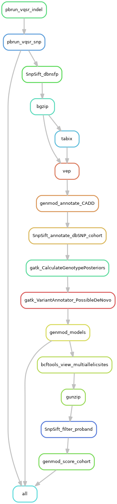

# vcf_annotation_pipeline

A Snakemake workflow to filter raw variants (snp and indels) and annotate vcf (variant call format) files of single samples (unrelated individuals) or cohort samples (related individuals) of paired-end sequencing data (WGS or WES) using [GATK4](https://gatk.broadinstitute.org/hc/en-us), [SnpSift](http://snpeff.sourceforge.net/SnpSift.html), [VEP](https://asia.ensembl.org/info/docs/tools/vep/index.html), [genmod](https://github.com/moonso/genmod) and [dbSNP](https://www.ncbi.nlm.nih.gov/SNP/). The vcf file can be optionally be prepared for ingestion into [scout](http://www.clinicalgenomics.se/scout/) which involves the removal of multiallelic sites and scoring/ranking of variants. The pipeline can run on [NVIDIA GPU's](https://www.nvidia.com/en-gb/graphics-cards/) where [nvidia clara parabricks software is available](https://www.nvidia.com/en-us/docs/parabricks/quickstart-guide/software-overview/) for *significant* speedups in analysis times. This pipeline is designed be used after [human_genomics_pipeline](https://github.com/ESR-NZ/human_genomics_pipeline) and before the data is ingested into [scout](https://github.com/Clinical-Genomics/scout) for clinical interpretation. However, this pipeline also stands on it's own, as a vcf annotation pipeline. This pipeline has been developed with human genetic data in mind, however we designed it to be species agnostic. Genetic data from other species can be analysed by setting a species-specific reference genome and variant databases in the configuration file (but not all situations have been tested).

- [vcf_annotation_pipeline](#vcf_annotation_pipeline)
  - [Pipeline summary - single samples](#pipeline-summary---single-samples)
  - [Pipeline summary - single samples - GPU accelerated](#pipeline-summary---single-samples---gpu-accelerated)
  - [Pipeline summary - cohort samples](#pipeline-summary---cohort-samples)
  - [Pipeline summary - cohort samples - GPU accelerated](#pipeline-summary---cohort-samples---gpu-accelerated)
  - [Main output files](#main-output-files)
  - [Prerequisites](#prerequisites)
  - [Test vcf_annotation_pipeline](#test-vcf_annotation_pipeline)
  - [Run vcf_annotation_pipeline](#run-vcf_annotation_pipeline)
  - [Contribute back!](#contribute-back)

## Pipeline summary - single samples

1. Filter variants ([gatk cnnscoreVariants](https://gatk.broadinstitute.org/hc/en-us/articles/360037226672-CNNScoreVariants) and [gatk FilterVariantTranches](https://gatk.broadinstitute.org/hc/en-us/articles/360042479092-FilterVariantTranches))
2. Annotate variants with known information (with [dbNSFP](http://database.liulab.science/dbNSFP), [vep](https://grch37.ensembl.org/info/docs/tools/vep/index.html), [CADD](https://cadd.gs.washington.edu/), [dbSNP](https://www.ncbi.nlm.nih.gov/snp/) databases)
3. Prepare for [scout](https://github.com/Clinical-Genomics/scout) (remove multiallelic sites, scoring/ranking of variants) (*optional*)

## Pipeline summary - single samples - GPU accelerated

1. Filter variants ([parabricks CNNScoreVariants](https://docs.nvidia.com/clara/parabricks/v3.6.1/text/variant_processing.html#cnnscorevariants) and [gatk FilterVariantTranches](https://gatk.broadinstitute.org/hc/en-us/articles/360042479092-FilterVariantTranches))
   - *Equivalent to [gatk cnnscoreVariants](https://gatk.broadinstitute.org/hc/en-us/articles/360037226672-CNNScoreVariants)*
2. Annotate variants with known information (with [dbNSFP](http://database.liulab.science/dbNSFP), [vep](https://grch37.ensembl.org/info/docs/tools/vep/index.html), [CADD](https://cadd.gs.washington.edu/), [dbSNP](https://www.ncbi.nlm.nih.gov/snp/) databases)
3. Prepare for [scout](https://github.com/Clinical-Genomics/scout) (remove multiallelic sites, scoring/ranking of variants) (*optional*)

## Pipeline summary - cohort samples

1. Filter variants ([gatk VariantRecalibrator](https://gatk.broadinstitute.org/hc/en-us/articles/360036351392-VariantRecalibrator) and [gatk ApplyVQSR](https://gatk.broadinstitute.org/hc/en-us/articles/360037423291-ApplyVQSR))
2. Annotate variants with known information (with [dbNSFP](http://database.liulab.science/dbNSFP), [vep](https://grch37.ensembl.org/info/docs/tools/vep/index.html), [CADD](https://cadd.gs.washington.edu/), [dbSNP](https://www.ncbi.nlm.nih.gov/snp/) databases)
3. Annotate variants with other information (genotype posterior probabilities, mark denovo variants, patterns of inheritance)
4. Prepare for [scout](https://github.com/Clinical-Genomics/scout) (remove multiallelic sites, filter for variants found in the proband, scoring/ranking of variants) (*optional*)

## Pipeline summary - cohort samples - GPU accelerated

1. Filter variants ([pbrun vqsr](https://docs.nvidia.com/clara/parabricks/v3.6.1/text/variant_processing.html#vqsr))
   - *Equivalent to [gatk VariantRecalibrator](https://gatk.broadinstitute.org/hc/en-us/articles/360036351392-VariantRecalibrator) and [gatk ApplyVQSR](https://gatk.broadinstitute.org/hc/en-us/articles/360037423291-ApplyVQSR)*
2. Annotate variants with known information (with [dbNSFP](http://database.liulab.science/dbNSFP), [vep](https://grch37.ensembl.org/info/docs/tools/vep/index.html), [CADD](https://cadd.gs.washington.edu/), [dbSNP](https://www.ncbi.nlm.nih.gov/snp/) databases)
3. Annotate variants with other information (genotype posterior probabilities, mark denovo variants, patterns of inheritance)
4. Prepare for [scout](https://github.com/Clinical-Genomics/scout) (remove multiallelic sites, filter for variants found in the proband, scoring/ranking of variants) (*optional*)

## Main output files

Single samples:

- `results/filtered/sample1_filtered.vcf`
- `results/annotated/sample1_filtered_annotated.vcf`
- `results/readyforscout/sample1_filtered_annotated_readyforscout.vcf.gz`

Cohort samples:

- `results/filtered/sample1_filtered.vcf`
- `results/annotated/sample1_filtered_annotated.vcf`
- `results/readyforscout/sample1_filtered_annotated_readyforscout.vcf`

## Prerequisites

- **Prerequisite hardware:** [NVIDIA GPUs](https://www.nvidia.com/en-gb/graphics-cards/) (for GPU accelerated runs)
- **Prerequisite software:** [NVIDIA CLARA parabricks and dependencies](https://www.nvidia.com/en-us/docs/parabricks/local-installation/) (for GPU accelerated runs), [Git](https://git-scm.com/) (tested with version 2.7.4), [Mamba](https://github.com/TheSnakePit/mamba) (tested with version 0.4.4) with [Conda](https://docs.conda.io/projects/conda/en/latest/index.html) (tested with version 4.8.2), [gsutil](https://pypi.org/project/gsutil/) (tested with version 4.52), [gunzip](https://linux.die.net/man/1/gunzip) (tested with version 1.6), [R](https://www.r-project.org/) (tested with version 3.2.2)

## Test vcf_annotation_pipeline

The provided [test dataset](./test) can be used to test running this pipeline on a new machine, or test pipeline developments/releases.

## Run vcf_annotation_pipeline

See the docs for a walkthrough guide for running [vcf_annotation_pipeline](https://github.com/ESR-NZ/vcf_annotation_pipeline) on:

- [A single machine like a laptop or single server/computer](./docs/running_on_a_single_machine.md)
- [A high performance cluster](./docs/running_on_a_hpc.md)

## Contribute back!

- Raise issues in [the issues page](https://github.com/ESR-NZ/vcf_annotation_pipeline/issues)
- Create feature requests in [the issues page](https://github.com/ESR-NZ/vcf_annotation_pipeline/issues)
- Contribute your code! Create your own branch from the [development branch](https://github.com/ESR-NZ/vcf_annotation_pipeline/tree/dev) and create a pull request to the [development branch](https://github.com/ESR-NZ/vcf_annotation_pipeline/tree/dev) once the code is on point!

Contributions and feedback are always welcome! :blush:
